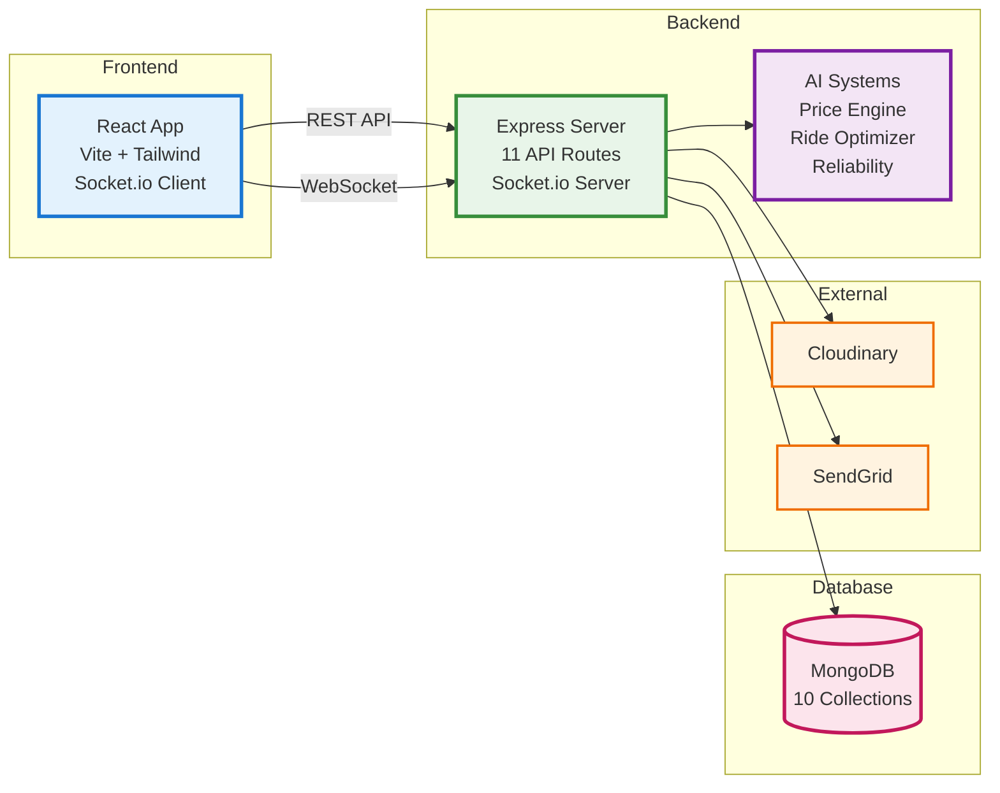
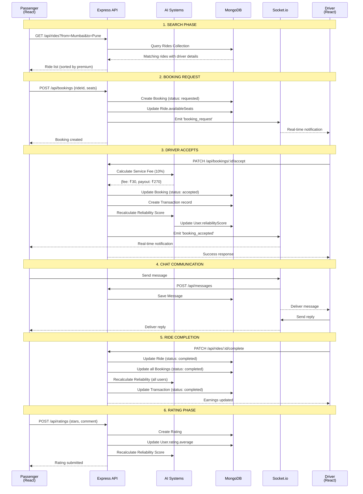
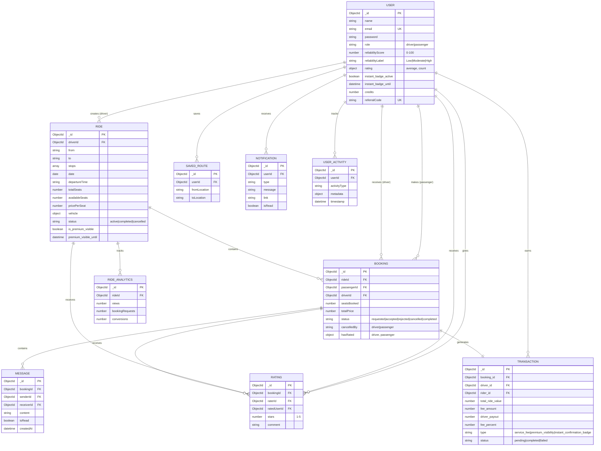
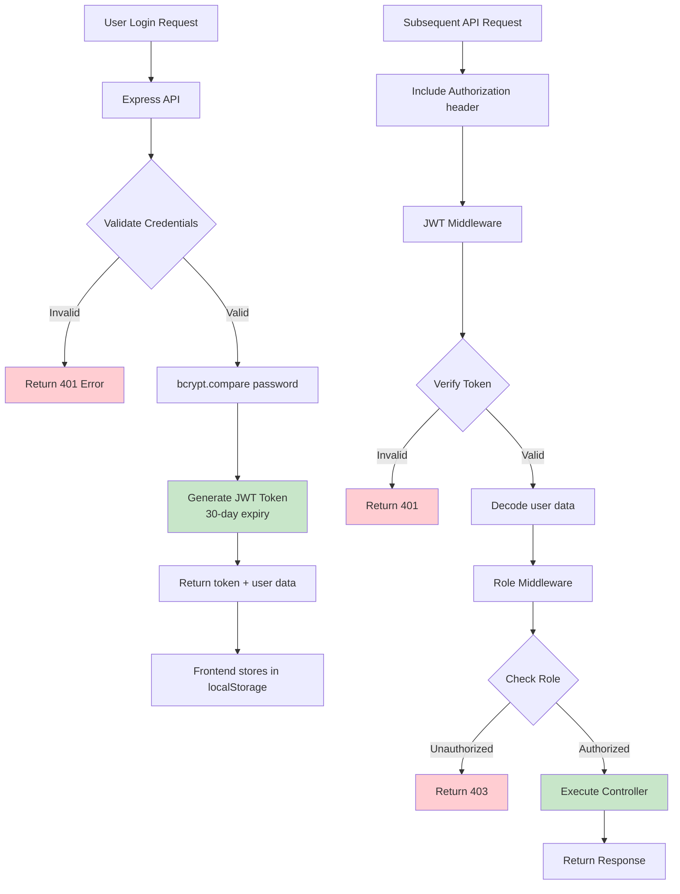
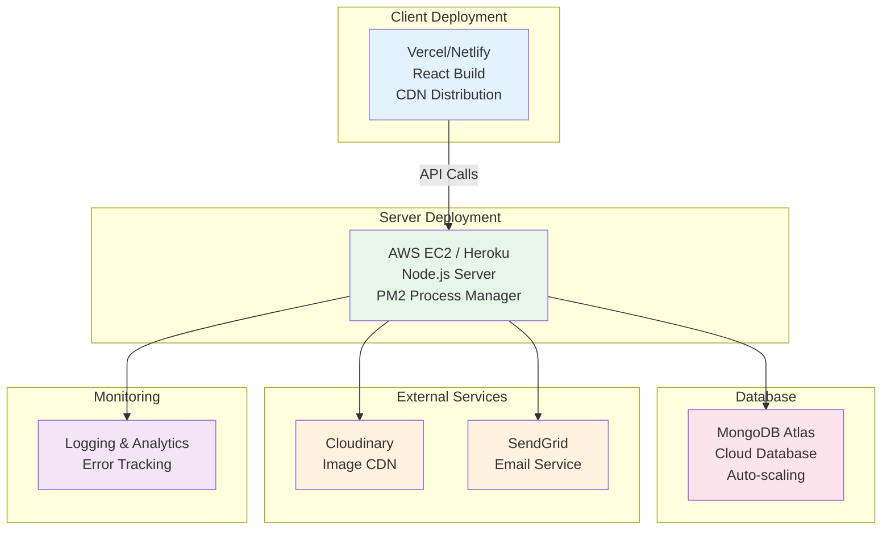
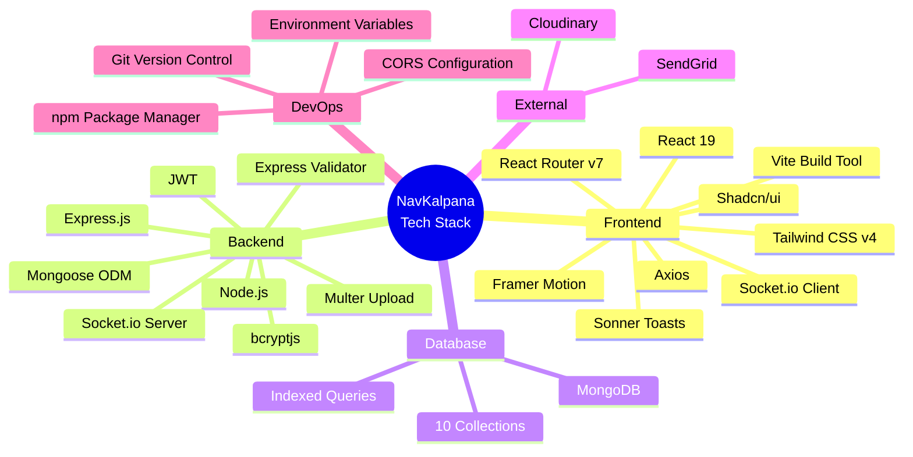

# NavKalpana - Complete Architecture Diagram (Mermaid Code)

## 🎯 MAIN SYSTEM ARCHITECTURE (Use this for presentation)

```mermaid
graph TB
    subgraph "CLIENT LAYER - Port 5173"
        A[React 19 Application]
        A1[React Router v7<br/>Navigation]
        A2[Context Providers<br/>Auth | Socket | Notification]
        A3[UI Components<br/>Tailwind CSS + Shadcn/ui]
        A4[Socket.io Client<br/>Real-time Communication]
        A5[Axios HTTP Client<br/>API Requests]
    end

    subgraph "API GATEWAY LAYER - Port 5000"
        B[Express.js Server]
        B1[CORS Middleware]
        B2[JWT Auth Middleware]
        B3[Role-based Access Control<br/>Driver | Passenger]
        B4[Socket.io Server<br/>WebSocket Handler]
        B5[Error Handler]
    end

    subgraph "ROUTING LAYER - 11 Route Modules"
        R1[/api/auth<br/>Login | Register | OTP]
        R2[/api/rides<br/>CRUD | Search | Boost]
        R3[/api/bookings<br/>Request | Accept | Cancel]
        R4[/api/messages<br/>Chat | Conversations]
        R5[/api/users<br/>Profile | Upload]
        R6[/api/ratings<br/>Submit | View]
        R7[/api/price-suggestion<br/>AI Pricing]
        R8[/api/driver/earnings<br/>Dashboard]
        R9[/api/saved-routes<br/>Save | Notify]
        R10[/api/recommendations<br/>Personalized]
        R11[/api/admin/analytics<br/>Platform Stats]
    end

    subgraph "CONTROLLER LAYER - Business Logic"
        C1[Auth Controller<br/>JWT | OTP | Password Reset]
        C2[Rides Controller<br/>CRUD | Optimization]
        C3[Bookings Controller<br/>Accept | Reject | Rate]
        C4[Messages Controller<br/>Send | Read | Unread Count]
        C5[Users Controller<br/>Profile | Badge Subscribe]
        C6[Ratings Controller<br/>Submit | Calculate Average]
        C7[Price Suggestion<br/>AI Algorithm]
        C8[Earnings Controller<br/>Transactions | Charts]
        C9[Saved Routes<br/>Save | Match Rides]
        C10[Recommendations<br/>ML-based Suggestions]
        C11[Analytics Controller<br/>Platform Metrics]
    end

    subgraph "INTELLIGENT SYSTEMS - Core Algorithms"
        AI1[AI Price Engine<br/>Distance × ₹4<br/>Demand Analysis<br/>±10% Range]
        AI2[Ride Optimizer<br/>Low Booking Detection<br/>Actionable Suggestions]
        AI3[Reliability Calculator<br/>4 Factors Weighted<br/>Score: 0-100]
        AI4[Recommendation Engine<br/>Saved Routes<br/>User Activity]
        AI5[Monetization System<br/>10% Service Fee<br/>Premium Features]
    end

    subgraph "UTILITY LAYER - Helper Functions"
        U1[calculateReliability.js]
        U2[calculateServiceFee.js]
        U3[getAverageRoutePrice.js]
        U4[getSeatDemand.js]
        U5[getOptimizationSuggestions.js]
        U6[getRideBookingRate.js]
        U7[isLowBookingRate.js]
        U8[generateToken.js]
        U9[sendEmail.js]
        U10[notification.js]
    end

    subgraph "DATA LAYER - MongoDB Collections"
        DB[(MongoDB Database)]
        D1[Users<br/>Auth | Profile | Ratings<br/>Reliability | Badges]
        D2[Rides<br/>Route | Price | Status<br/>Premium Visibility]
        D3[Bookings<br/>Request | Status<br/>Seats | Price]
        D4[Transactions<br/>Earnings | Fees<br/>Premium Purchases]
        D5[Messages<br/>Chat History<br/>Read Status]
        D6[Ratings<br/>Stars | Comments<br/>Booking Reference]
        D7[SavedRoutes<br/>User Preferences<br/>Notifications]
        D8[Notifications<br/>In-app Alerts<br/>Read Status]
        D9[RideAnalytics<br/>Platform Metrics]
        D10[UserActivity<br/>Behavior Tracking]
    end

    subgraph "EXTERNAL SERVICES"
        E1[Cloudinary<br/>Image Storage<br/>Profile Photos]
        E2[SendGrid/Nodemailer<br/>Email Service<br/>OTP Delivery]
    end

    %% Client to API Gateway
    A --> A1
    A --> A2
    A --> A3
    A1 --> A5
    A2 --> A4
    A5 -->|HTTP/REST| B
    A4 -->|WebSocket| B4

    %% API Gateway Processing
    B --> B1
    B1 --> B2
    B2 --> B3
    B --> B4
    B --> B5

    %% Gateway to Routes
    B3 --> R1
    B3 --> R2
    B3 --> R3
    B3 --> R4
    B3 --> R5
    B3 --> R6
    B3 --> R7
    B3 --> R8
    B3 --> R9
    B3 --> R10
    B3 --> R11

    %% Routes to Controllers
    R1 --> C1
    R2 --> C2
    R3 --> C3
    R4 --> C4
    R5 --> C5
    R6 --> C6
    R7 --> C7
    R8 --> C8
    R9 --> C9
    R10 --> C10
    R11 --> C11

    %% Controllers to Intelligent Systems
    C2 --> AI1
    C2 --> AI2
    C3 --> AI3
    C3 --> AI5
    C7 --> AI1
    C8 --> AI5
    C10 --> AI4

    %% Intelligent Systems to Utils
    AI1 --> U3
    AI1 --> U4
    AI2 --> U5
    AI2 --> U6
    AI2 --> U7
    AI3 --> U1
    AI5 --> U2

    %% Controllers to Utils
    C1 --> U8
    C1 --> U9
    C5 --> U10

    %% Controllers to Database
    C1 --> DB
    C2 --> DB
    C3 --> DB
    C4 --> DB
    C5 --> DB
    C6 --> DB
    C7 --> DB
    C8 --> DB
    C9 --> DB
    C10 --> DB
    C11 --> DB

    %% Database Collections
    DB --> D1
    DB --> D2
    DB --> D3
    DB --> D4
    DB --> D5
    DB --> D6
    DB --> D7
    DB --> D8
    DB --> D9
    DB --> D10

    %% External Services
    C5 --> E1
    C1 --> E2

    %% Styling
    classDef clientStyle fill:#E3F2FD,stroke:#1976D2,stroke-width:2px
    classDef apiStyle fill:#E8F5E9,stroke:#388E3C,stroke-width:2px
    classDef routeStyle fill:#FFF9C4,stroke:#F57C00,stroke-width:2px
    classDef controllerStyle fill:#FFE0B2,stroke:#E64A19,stroke-width:2px
    classDef aiStyle fill:#F3E5F5,stroke:#7B1FA2,stroke-width:3px
    classDef utilStyle fill:#E0F2F1,stroke:#00796B,stroke-width:2px
    classDef dbStyle fill:#FCE4EC,stroke:#C2185B,stroke-width:2px
    classDef externalStyle fill:#FFF3E0,stroke:#EF6C00,stroke-width:2px

    class A,A1,A2,A3,A4,A5 clientStyle
    class B,B1,B2,B3,B4,B5 apiStyle
    class R1,R2,R3,R4,R5,R6,R7,R8,R9,R10,R11 routeStyle
    class C1,C2,C3,C4,C5,C6,C7,C8,C9,C10,C11 controllerStyle
    class AI1,AI2,AI3,AI4,AI5 aiStyle
    class U1,U2,U3,U4,U5,U6,U7,U8,U9,U10 utilStyle
    class DB,D1,D2,D3,D4,D5,D6,D7,D8,D9,D10 dbStyle
    class E1,E2 externalStyle
```

---

## 📊 SIMPLIFIED VERSION (For Quick Overview)



---

## 🔄 DATA FLOW - COMPLETE BOOKING JOURNEY



---

## 🧠 AI SYSTEMS ARCHITECTURE

```mermaid
graph TB
    subgraph "AI Price Suggestion Engine"
        PS1[Input: from, to, date, distance]
        PS2[Calculate Base Price<br/>distance × ₹4]
        PS3[Query Bookings ±3 days]
        PS4[Query Saved Routes]
        PS5[Determine Demand Level<br/>High | Moderate | Low]
        PS6[Apply Multiplier<br/>+20% | +10% | 0%]
        PS7[Calculate Range ±10%]
        PS8[Output: min, max, demand]
        
        PS1 --> PS2
        PS2 --> PS3
        PS2 --> PS4
        PS3 --> PS5
        PS4 --> PS5
        PS5 --> PS6
        PS6 --> PS7
        PS7 --> PS8
    end

    subgraph "Ride Optimization System"
        RO1[Input: rideId]
        RO2[Calculate Fill Rate<br/>booked/total seats]
        RO3[Calculate Hours Since Posted]
        RO4{Low Booking?<br/><30% & >12hrs<br/>OR 0% & >6hrs}
        RO5[Analyze Attributes<br/>Price | Details | Time]
        RO6[Generate Suggestions<br/>with Action Buttons]
        RO7[Output: suggestions array]
        
        RO1 --> RO2
        RO1 --> RO3
        RO2 --> RO4
        RO3 --> RO4
        RO4 -->|Yes| RO5
        RO4 -->|No| RO7
        RO5 --> RO6
        RO6 --> RO7
    end

    subgraph "Reliability Calculator"
        RC1[Input: userId]
        RC2[Fetch User Data<br/>Bookings | Rides | Ratings]
        RC3[Completion Rate 40%<br/>completed/total]
        RC4[Cancellation Rate 25%<br/>1 - cancelled/total]
        RC5[Rating Average 25%<br/>stars/5 × 25]
        RC6[Response Score 10%<br/>accepted/requested]
        RC7[Sum Components<br/>Total: 0-100]
        RC8[Assign Label<br/>Low | Moderate | High]
        RC9[Update User Document]
        
        RC1 --> RC2
        RC2 --> RC3
        RC2 --> RC4
        RC2 --> RC5
        RC2 --> RC6
        RC3 --> RC7
        RC4 --> RC7
        RC5 --> RC7
        RC6 --> RC7
        RC7 --> RC8
        RC8 --> RC9
    end

    subgraph "Monetization System"
        M1[Service Fee Calculator<br/>10% on bookings]
        M2[Premium Visibility<br/>₹99 for 7 days]
        M3[Instant Badge<br/>₹199 for 30 days]
        M4[Transaction Recorder]
        M5[Earnings Dashboard]
        
        M1 --> M4
        M2 --> M4
        M3 --> M4
        M4 --> M5
    end

    style PS1 fill:#E1F5FE
    style PS8 fill:#C8E6C9
    style RO1 fill:#FFF9C4
    style RO7 fill:#FFE0B2
    style RC1 fill:#F3E5F5
    style RC9 fill:#E1BEE7
    style M5 fill:#FFCCBC
```

---

## 🗄️ DATABASE SCHEMA RELATIONSHIPS



---

## 🔐 SECURITY & AUTHENTICATION FLOW



---

## 📱 FRONTEND COMPONENT HIERARCHY

```mermaid
graph TB
    APP[App.jsx<br/>BrowserRouter]
    
    APP --> PROVIDERS[Context Providers]
    PROVIDERS --> AUTH[AuthContext<br/>User State]
    PROVIDERS --> SOCKET[SocketContext<br/>WebSocket]
    PROVIDERS --> NOTIF[NotificationContext<br/>Alerts]
    
    APP --> ROUTES[React Router]
    
    ROUTES --> PUBLIC[Public Routes]
    PUBLIC --> HOME[Home]
    PUBLIC --> LOGIN[Login]
    PUBLIC --> REGISTER[Register]
    PUBLIC --> SEARCH[SearchRides]
    
    ROUTES --> PROTECTED[Protected Routes]
    PROTECTED --> PROFILE[Profile]
    PROTECTED --> CHAT[Chat]
    PROTECTED --> NOTIFICATIONS[Notifications]
    
    ROUTES --> DRIVER[Driver Routes]
    DRIVER --> DDASH[DriverDashboard]
    DRIVER --> CREATE[CreateRide]
    DRIVER --> MYRIDES[MyPostedRides]
    DRIVER --> BOOKREQ[BookingRequests]
    
    ROUTES --> PASSENGER[Passenger Routes]
    PASSENGER --> PDASH[PassengerDashboard]
    PASSENGER --> BOOKHISTORY[BookingHistory]
    
    APP --> SHARED[Shared Components]
    SHARED --> NAVBAR[Navbar]
    SHARED --> FOOTER[Footer]
    SHARED --> MOBILE[MobileBottomNav]
    
    SHARED --> COMPONENTS[Reusable Components]
    COMPONENTS --> RIDECARD[RideCard]
    COMPONENTS --> CHATWINDOW[ChatWindow]
    COMPONENTS --> RELIABILITY[ReliabilityBadge]
    COMPONENTS --> RATING[StarRating]
    COMPONENTS --> NOTIFBELL[NotificationBell]
    
    style APP fill:#E3F2FD,stroke:#1976D2,stroke-width:3px
    style PROVIDERS fill:#F3E5F5,stroke:#7B1FA2,stroke-width:2px
    style DRIVER fill:#E8F5E9,stroke:#388E3C,stroke-width:2px
    style PASSENGER fill:#FFF9C4,stroke:#F57C00,stroke-width:2px
```



---

## 🚀 DEPLOYMENT ARCHITECTURE (Future)



---

## 📊 TECHNOLOGY STACK BREAKDOWN



---

## 🎯 KEY FEATURES FLOW

```mermaid
graph LR
    A[User Actions] --> B{Role?}
    
    B -->|Driver| C[Driver Features]
    C --> C1[Post Ride<br/>AI Price Suggestion]
    C --> C2[Manage Bookings<br/>Accept/Reject]
    C --> C3[View Earnings<br/>Transaction History]
    C --> C4[Ride Optimization<br/>Suggestions]
    C --> C5[Premium Features<br/>Boost | Badge]
    
    B -->|Passenger| D[Passenger Features]
    D --> D1[Search Rides<br/>Filters]
    D --> D2[Request Booking<br/>Real-time Chat]
    D --> D3[Save Routes<br/>Get Notifications]
    D --> D4[View History<br/>Rate Drivers]
    D --> D5[Recommendations<br/>Personalized]
    
    C1 --> E[AI Systems]
    C4 --> E
    D5 --> E
    
    C2 --> F[Real-time Updates]
    D2 --> F
    
    C3 --> G[Monetization]
    C5 --> G
    
    style E fill:#F3E5F5,stroke:#7B1FA2,stroke-width:3px
    style F fill:#E3F2FD,stroke:#1976D2,stroke-width:3px
    style G fill:#FFE0B2,stroke:#E64A19,stroke-width:3px
```

---

## 📝 NOTES FOR PRESENTATION

### Which Diagram to Use Where:
1. **Slide 5 (Architecture Overview):** Use "MAIN SYSTEM ARCHITECTURE"
2. **Slide 10 (Real-time Features):** Use "DATA FLOW - COMPLETE BOOKING JOURNEY"
3. **Slide 12 (AI Systems):** Use "AI SYSTEMS ARCHITECTURE"
4. **Slide 11 (Database):** Use "DATABASE SCHEMA RELATIONSHIPS"
5. **Slide 17 (Security):** Use "SECURITY & AUTHENTICATION FLOW"

### How to Export:
1. Go to https://mermaid.live/
2. Copy the diagram code
3. Paste in editor
4. Click "Download PNG" (300 DPI recommended)
5. Insert into PowerPoint

### Color Legend:
- 🔵 Blue: Client/Frontend Layer
- 🟢 Green: API/Backend Layer
- 🟡 Yellow: Routing Layer
- 🟠 Orange: Controller Layer
- 🟣 Purple: AI/Intelligent Systems
- 🔴 Red: Database Layer
- 🟤 Brown: External Services
